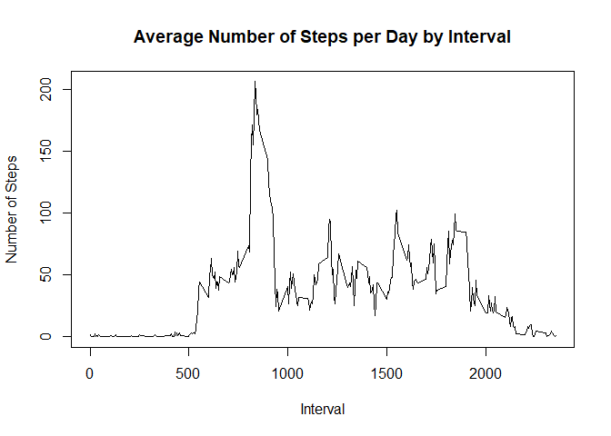

## Loading and preprocessing the data


```r
# 1. Load the data
if (!file.exists("activity.csv") )
    {
     durl <- 'http://d396qusza40orc.cloudfront.net/repdata%2Fdata%2Factivity.zip'  
     download.file(durl,destfile='repdata%2Fdata%2Factivity.zip',mode='wb')  
     unzip('repdata%2Fdata%2Factivity.zip')
    }
data <- read.csv("activity.csv")
```


```r
# 2. Process/transform the data (if necessary) into a format suitable for your analysis
# The data for the variable date is converted into class Date
data$date <- as.Date(data$date)
```

## What is mean total number of steps taken per day?


```r
# 1.Calculate the total number of steps taken per day
steps_day <- aggregate(steps ~ date, data, sum)
print(steps_day)
```

```
##          date steps
## 1  2012-10-02   126
## 2  2012-10-03 11352
## 3  2012-10-04 12116
## 4  2012-10-05 13294
## 5  2012-10-06 15420
## 6  2012-10-07 11015
## 7  2012-10-09 12811
## 8  2012-10-10  9900
## 9  2012-10-11 10304
## 10 2012-10-12 17382
## 11 2012-10-13 12426
## 12 2012-10-14 15098
## 13 2012-10-15 10139
## 14 2012-10-16 15084
## 15 2012-10-17 13452
## 16 2012-10-18 10056
## 17 2012-10-19 11829
## 18 2012-10-20 10395
## 19 2012-10-21  8821
## 20 2012-10-22 13460
## 21 2012-10-23  8918
## 22 2012-10-24  8355
## 23 2012-10-25  2492
## 24 2012-10-26  6778
## 25 2012-10-27 10119
## 26 2012-10-28 11458
## 27 2012-10-29  5018
## 28 2012-10-30  9819
## 29 2012-10-31 15414
## 30 2012-11-02 10600
## 31 2012-11-03 10571
## 32 2012-11-05 10439
## 33 2012-11-06  8334
## 34 2012-11-07 12883
## 35 2012-11-08  3219
## 36 2012-11-11 12608
## 37 2012-11-12 10765
## 38 2012-11-13  7336
## 39 2012-11-15    41
## 40 2012-11-16  5441
## 41 2012-11-17 14339
## 42 2012-11-18 15110
## 43 2012-11-19  8841
## 44 2012-11-20  4472
## 45 2012-11-21 12787
## 46 2012-11-22 20427
## 47 2012-11-23 21194
## 48 2012-11-24 14478
## 49 2012-11-25 11834
## 50 2012-11-26 11162
## 51 2012-11-27 13646
## 52 2012-11-28 10183
## 53 2012-11-29  7047
```


```r
# 2.Make a histogram of the total number of steps taken each day
hist(steps_day$steps, main = "Total Steps Each Day", col="blue", xlab="Number of Steps")
```

<!-- -->


```r
# 3.Calculate and report the mean and median of the total number of steps taken per day
mean_steps <- mean(steps_day$steps)
mean_steps
```

```
## [1] 10766.19
```

```r
median_steps<-median(steps_day$steps)
median_steps
```

```
## [1] 10765
```
The mean of the total number of steps taken per day is 1.0766189\times 10^{4}   
The median of the total number of steps taken per day is 10765 

## What is the average daily activity pattern?


```r
# 1. Make a time series plot of the 5-minute interval and the average number of steps taken, averaged across all days
steps_interval<-aggregate(steps ~ interval, data, mean)
plot(steps_interval$interval,steps_interval$steps, type="l", xlab="Interval", 
     ylab="Number of Steps",main="Average Number of Steps per Day by Interval")
```

<!-- -->


```r
# 2.Which 5-minute interval, on average across all the days in the dataset, contains the maximum number of steps?
max_interval <- steps_interval[which.max(steps_interval$steps),1]
max_interval
```

```
## [1] 835
```
The 5-minute interval that contains the maximum number of steps is the 835th interval.

## Imputing missing values


```r
# 1. Calculate and report the total number of missing values in the dataset
NATotal <- sum(!complete.cases(data))
NATotal
```

```
## [1] 2304
```
The total number of missing values in the dataset is 2304


```r
# 2. Devise a strategy for filling in all of the missing values in the dataset. 
# Using Mean for the day to compute missing values
StepsAverage <- aggregate(steps ~ interval, data, mean)
fillNA <- numeric()
for (i in 1:nrow(data)) {
    obs <- data[i, ]
    if (is.na(obs$steps)) {
        steps <- subset(StepsAverage, interval == obs$interval)$steps
    } else {
        steps <- obs$steps
    }
    fillNA <- c(fillNA, steps)
}
```


```r
# 3. Create a new dataset that is equal to the original dataset but with the missing data filled in.
new_data <- data
new_data$steps <- fillNA
```


```r
# 4. Make a histogram of the total number of steps taken each day.
Nsteps_day <- aggregate(steps ~ date, new_data, sum)
hist(Nsteps_day$steps, main = "Total Steps Each Day", col="green",xlab="Number of Steps")
```

<!-- -->

```r
# Calculate and report the mean and median total number of steps taken per day. 
Nmean_steps <- mean(Nsteps_day$steps)
Nmean_steps
```

```
## [1] 10766.19
```

```r
Nmedian_steps<-median(Nsteps_day$steps)
Nmedian_steps
```

```
## [1] 10766.19
```
The mean of the total number of steps taken per day is 1.0766189\times 10^{4}   
The median of the total number of steps taken per day is 1.0766189\times 10^{4} 

```r
# Do these values differ from the estimates from the first part of the assignment? 
mean_diff <- mean_steps - Nmean_steps
mean_diff
```

```
## [1] 0
```

```r
median_diff <- median_steps - Nmedian_steps
median_diff
```

```
## [1] -1.188679
```
The difference in mean is 0 and the median is -1.1886792.  
Thus, there is no difference in the mean value. However, the median differs from the first part.

What is the impact of imputing missing data on the estimates of the total daily number of steps?   

Comparing with the calculations done in the first section of this document, we observe that while the mean value remains unchanged, the median value has shifted and matches to the mean.

## Are there differences in activity patterns between weekdays and weekends?


```r
# 1.Create a new factor variable in the dataset with two levels- “weekday” and “weekend”. 
weekdays <- c("Monday", "Tuesday", "Wednesday", "Thursday", "Friday")
new_data$dow <- as.factor(ifelse(is.element(weekdays(as.Date(new_data$date)),weekdays), "Weekday", "Weekend"))
```


```r
# 2. Make a panel plot containing a time series plot  of the 5-minute interval (x-axis) and the average number of steps taken, averaged across all weekday days or weekend days (y-axis)
NStepsAverage <- aggregate(steps ~ interval + dow, new_data, mean)
library(lattice)
xyplot(NStepsAverage$steps ~ NStepsAverage$interval|NStepsAverage$dow, main="Average Number of Steps per Day by Interval",xlab="Interval", ylab="Number of Steps",layout=c(1,2), type="l")
```

<!-- -->
